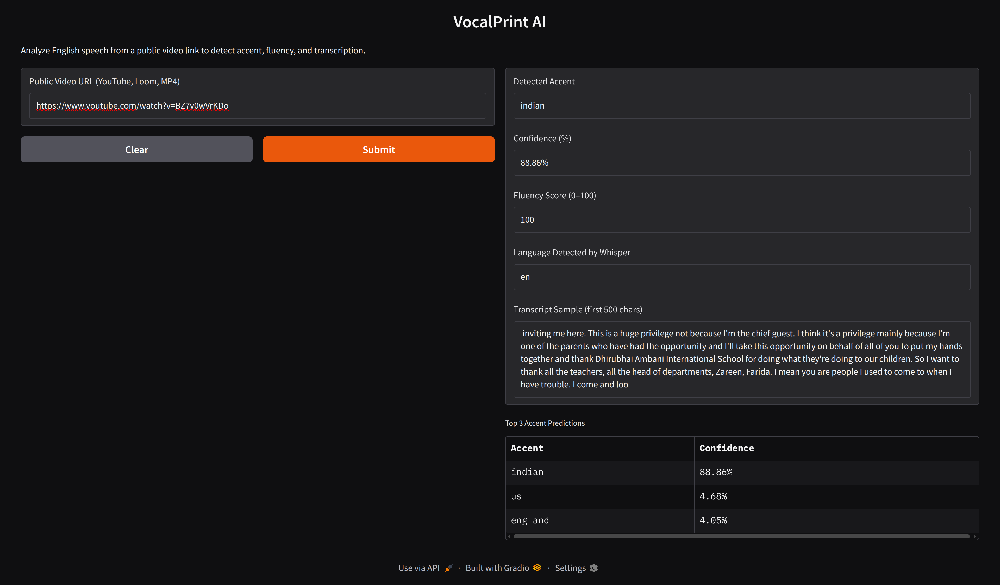
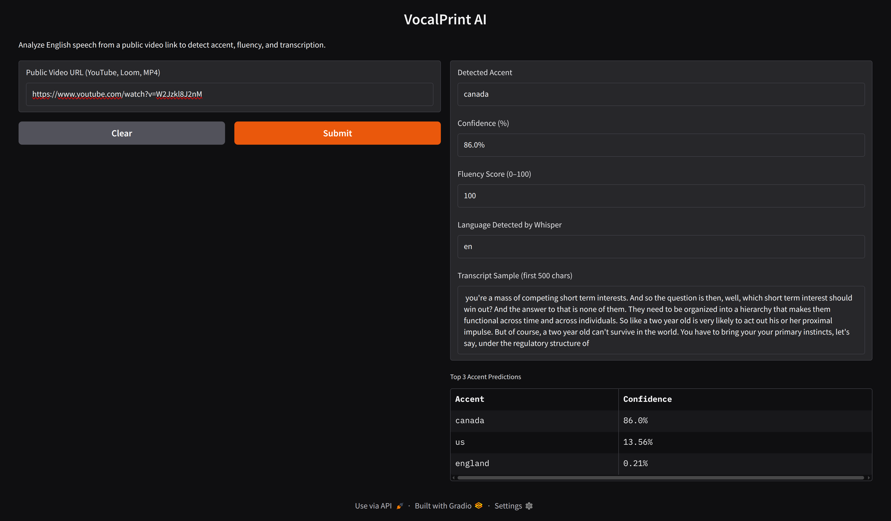

# VocalPrint AI

VocalPrint AI is a CLI + web based tool that detects spoken English accents, scores fluency, and transcribes speech from public video/audio sources.

---

## Features

- Detects common English accents:
  - Indian, American, British, Australian, and more
- Scores fluency based on actual speaking duration
- Transcribes speech using OpenAI's Whisper model
- Top-3 accent predictions with confidence values
- Supports YouTube, Loom, and direct MP4 links
- Web UI built using Gradio for fast testing
- CLI and Web UI use a shared processing core
- JSON output for easy API integration

---

## Technical Highlights

- **Models Used**:
  - Whisper (for transcription + language detection)
  - `dima806/english_accents_classification` (for accent prediction)

- **Audio Segment Handling**:
  - Only a 30-second segment is extracted from the middle of the video for analysis (to avoid intros and outros)
  
- **Transcript Handling**:
  - Only the first 500 characters of the transcript are returned to keep the result clean

- **Output**:
  - Returns JSON with detected accent, confidence %, top-3 predictions, fluency score, language code, and sample transcript

---

## Project Structure

```
vocalprint-ai/
├── core/
│   ├── __init__.py
│   ├── processor.py         # shared logic used by both CLI and web
│   └── logger.py            # shared logger instance
├── accent_detection_cli.py  # CLI entrypoint
├── web/
│   └── app.py               # Web UI via Gradio
├── requirements.txt
├── README.md
└── .gitignore
```

---

## Quick Start

### 1. Install dependencies

```bash
pip3 install -r requirements.txt
```

### 2. Run the CLI tool

```bash
python3 accent_detection_cli.py \            
  --url "https://www.youtube.com/watch?v=W2Jzkl8J2nM" \ 
  --device cpu
```

### 3. Sample output

```bash
{
  "accent": "canada",
  "accent_confidence": 86.0,
  "top_3_predictions": [
    {
      "accent": "canada",
      "confidence": 86.0
    },
    {
      "accent": "us",
      "confidence": 13.56
    },
    {
      "accent": "england",
      "confidence": 0.21
    }
  ],
  "fluency_score": 100,
  "language_detected_by_whisper": "en",
  "transcript_sample": " you're a mass of competing short term interests. And so the question is then, well, which short term interest should win out? And the answer to that is none of them. They need to be organized into a hierarchy that makes them functional across time and across individuals. So like a two year old is v"
}
```

### 4. Run the Web UI

```bash
python3 web/app.py
```
Then open `http://localhost:7860` in your browser.

---

## Example Outputs

### 🎤 Example 1 – Indian Accent  
**URL:** [https://www.youtube.com/watch?v=BZ7v0wVrKDo](https://www.youtube.com/watch?v=BZ7v0wVrKDo)



### 🎤 Example 2 – Canadian Accent  
**URL:** [https://www.youtube.com/watch?v=W2Jzkl8J2nM](https://www.youtube.com/watch?v=W2Jzkl8J2nM)



---

## Known Bottlenecks

- Whisper runs on CPU if no GPU is available — can be slow (~20s on CPU)
- Video download + audio extraction depends on stable network and FFmpeg
- Some accent misclassifications may occur for mixed/regional speakers
- Web UI uses a 30-second middle segment — long videos may not be fully analyzed

---